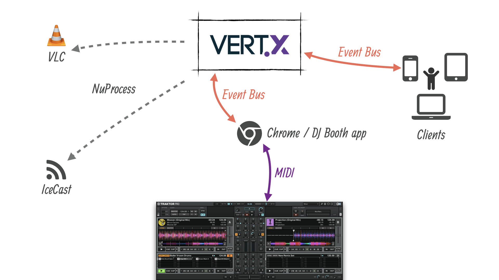
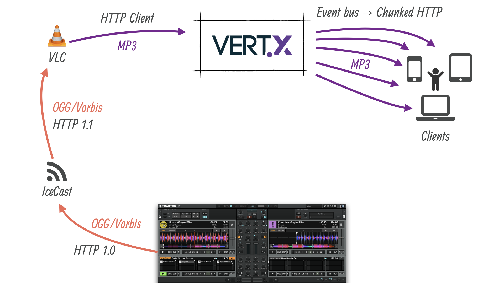

# Boiler Vroom

> Fun is fun, powered by Vert.x.

This is the _Boiler Vroom_ demo that was first introduced in the [Devoxx France 2017 University session on reactive programming with Eclipse Vert.x](https://www.youtube.com/watch?v=ZkWsilpiSqw) by Julien Ponge and Julien Viet.

This demo is based on a Dj-ing experience with Traktor Pro 2 where the audience can interact through web applications on the mix:

* change patterns in a sequencer that controls a _remix deck_,
* apply filter effects,
* see what the Dj does on volumes and EQs,
* listen to the mix broadcast on their devices.

## Tools and projects

* Traktor Pro 2
* Eclipse Vert.x
* NuProcess
* WebMidi (via WebMidi.js)
* Gradle
* Google Chrome
* WebPack
* Babel
* VLC
* IceCast

## License

    Copyright (c) 2017 Red Hat, Inc. and/or its affiliates.

    Licensed under the Apache License, Version 2.0 (the "License");
    you may not use this file except in compliance with the License.
    You may obtain a copy of the License at

        http://www.apache.org/licenses/LICENSE-2.0

    Unless required by applicable law or agreed to in writing, software
    distributed under the License is distributed on an "AS IS" BASIS,
    WITHOUT WARRANTIES OR CONDITIONS OF ANY KIND, either express or implied.
    See the License for the specific language governing permissions and
    limitations under the License.

Initial implementation by [Julien Ponge](https://julien.ponge.org/).
